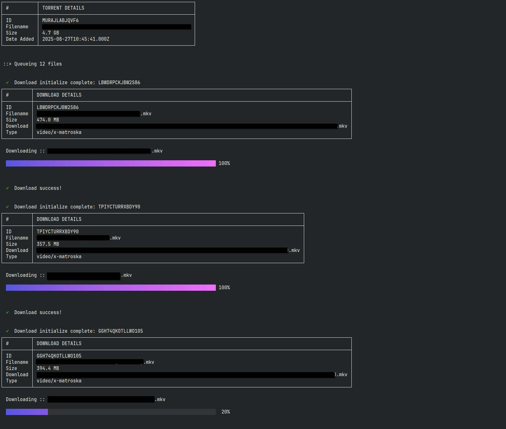

# realdebrid-cli

Manage your real-debrid account via a cli.

```sh
go install github.com/tbdsux/realdebrid-cli/rd@latest
```

## Usage

```sh
❯ rd

Real-Debrid CLI

Manage your Real-Debrid files and account.

Usage:
  rd [command]

Available Commands:
  account        Show account information
  completion     Generate the autocompletion script for the specified shell
  config         Manage configuration settings
  downloads      List available downloadable files
  help           Help about any command
  torrents       List all torrents
  upload-magnet  Upload a magnet link
  upload-torrent Upload a torrent file

Flags:
      --config string   config file (default is $HOME/.realdebrid-cli.yaml)
  -d, --debug           Enable debug mode
  -h, --help            help for rd

Use "rd [command] --help" for more information about a command.
```

#### Starting Use

Make sure to setup your config key buy doing:

```sh
# setup config
❯ rd config init


# verify your api key
❯ rd config

# show your account details
❯ rd account
```

### Example

```
❯ rd torrents
```

> OUTPUT:
>
> 

## Development

CLI uses [Bubble Tea](https://github.com/charmbracelet/bubbletea/) for some power for the commands.

> This is not a TUI app though.
